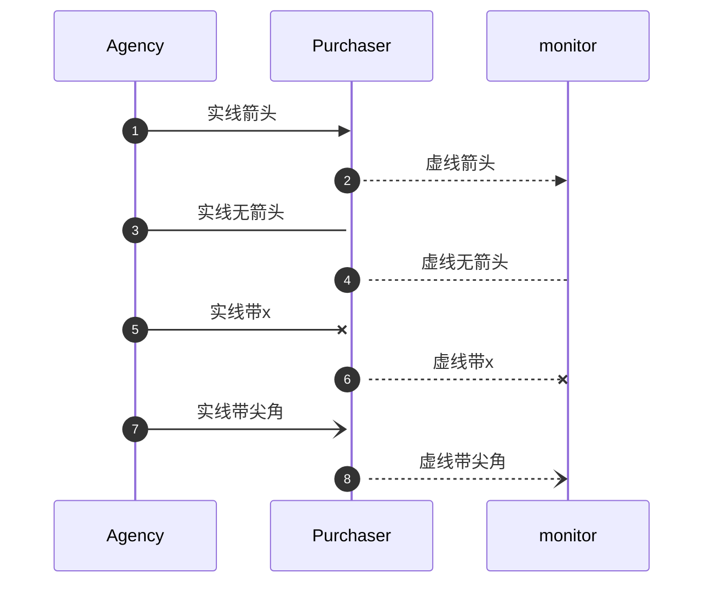
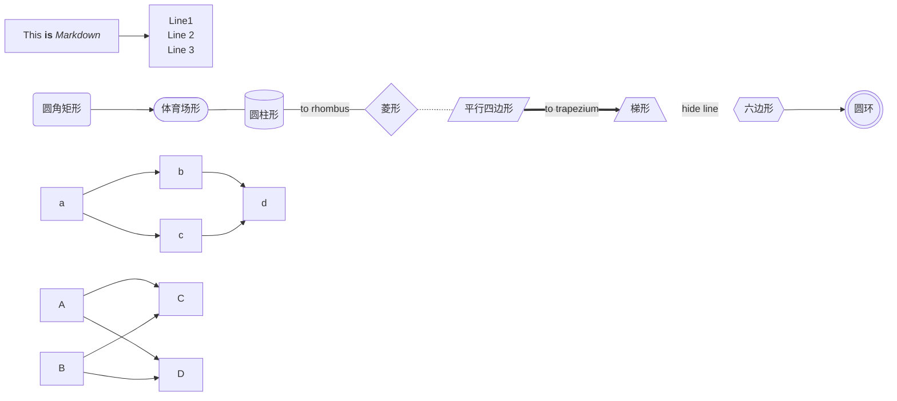
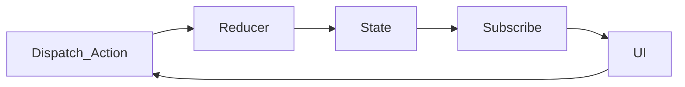
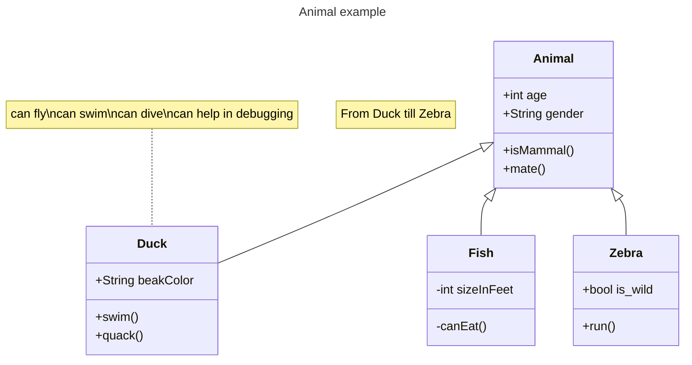
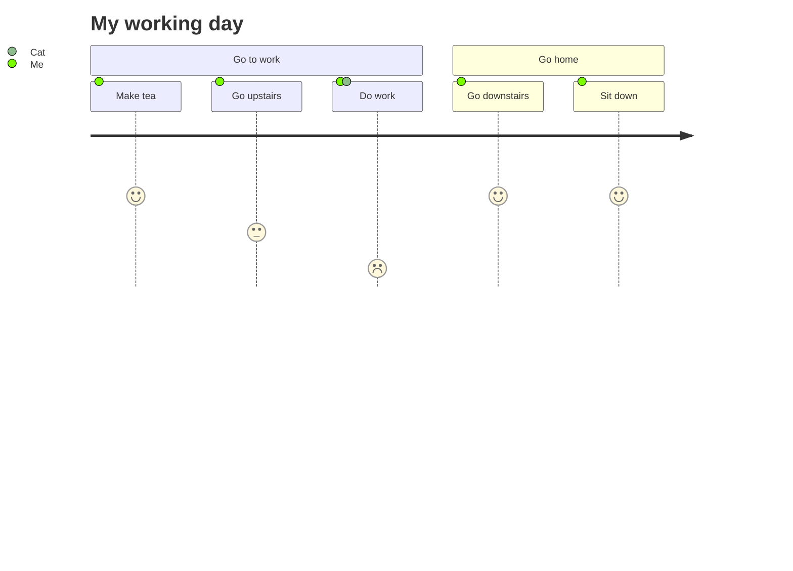
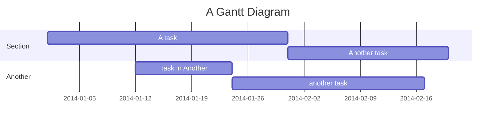
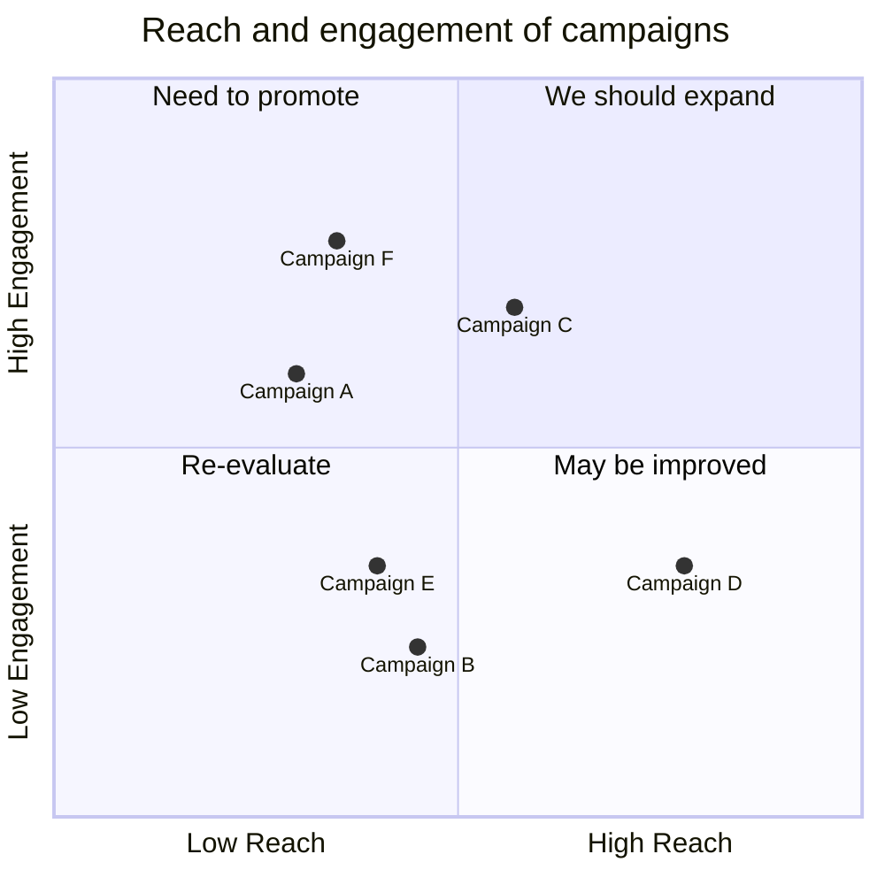

# markdown mermaid

> 网站<https://mermaid.nodejs.cn/intro/>

## sequenceDiagram

[more](https://blog.csdn.net/Tuing_/article/details/129875279)

## flowchart

## graph

## class

## journey

## gantt

## pie

## quadrantChart

