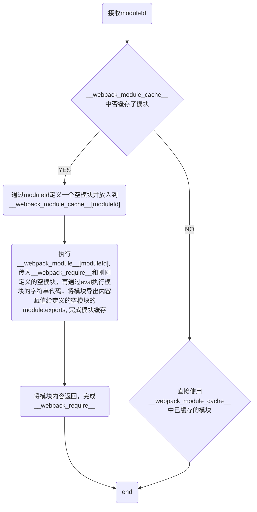
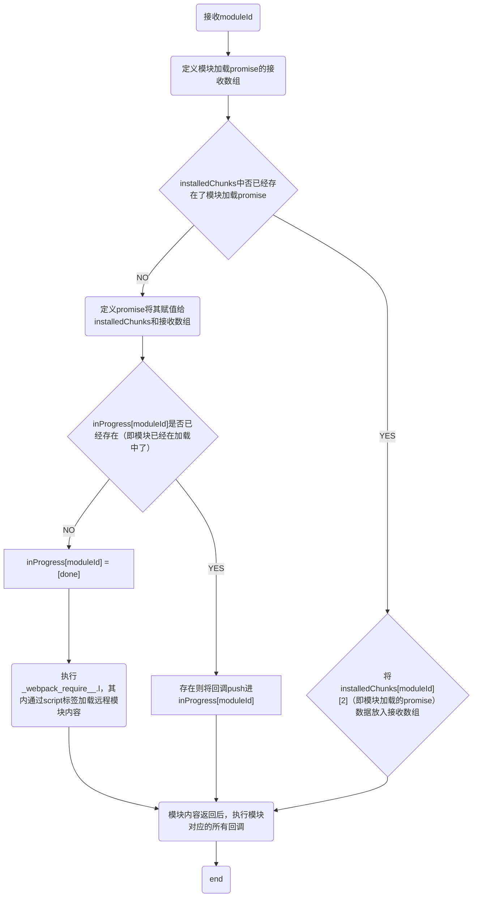

> webpack 打包后的产物为什么能实现模块加载？

[toc]

## &lowbar;&lowbar;webpack_require&lowbar;&lowbar;

1. `__webpack_require__`

```mermaid
flowchart TD
  receiptModuleId(接收moduleId)
  ifCachedModule{"__webpack_module_cache__中否缓存了模块"}
  useCachedModule{"直接使用__webpack_module_cache__中已缓存的模块"}
  definedModule("通过moduleId定义一个空模块并放入到__webpack_module_cache__[moduleId]")
  executeStringCode("执行__webpack_module__[moduleId], 传入__webpack_require__和刚刚定义的空模块，再通过eval执行模块的字符串代码，将模块导出内容赋值给定义的空模块的module.exports, 完成模块缓存")
  returnModuleContent("将模块内容返回，完成__webpack_require__")
  executeEnd(end)

  receiptModuleId-->ifCachedModule--YES-->definedModule-->executeStringCode-->returnModuleContent-->executeEnd
  ifCachedModule--NO-->useCachedModule-->executeEnd
```

2. `__webpack_require__`.e

```mermaid
flowchart TD
  receiptModuleId(接收moduleId)
  definedAcceptArr(定义模块加载promise的接收数组)
  ifCachedModule{"installedChunks中否已经存在了模块加载promise"}
  useLoadPromise{"将installedChunks[moduleId][2]（即模块加载的promise）数据放入接收数组"}
  definedLoadModulePromise(定义promise将其赋值给installedChunks和接收数组)
  ifLoadingModule{"inProgress[moduleId]是否已经存在（即模块已经在加载中了）"}
  notInProgress["inProgress[moduleId] = [done]"]
  yesInProgress["存在则将回调push进inProgress[moduleId]"]
  executeStringCode("执行_webpack_require__.l，其内通过script标签加载远程模块内容")
  returnModuleContent("模块内容返回后，执行模块对应的所有回调")
  executeEnd(end)

  receiptModuleId-->definedAcceptArr-->ifCachedModule--NO-->definedLoadModulePromise-->ifLoadingModule--NO-->notInProgress-->executeStringCode-->returnModuleContent-->executeEnd
  ifCachedModule--YES-->useLoadPromise-->returnModuleContent
  ifLoadingModule--YES-->yesInProgress-->returnModuleContent
```

