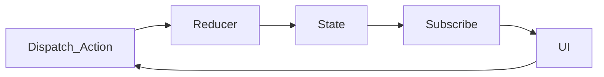

> Redux 是一个使用叫作 "actions" 的事件去管理和更新应用状态的模式和工具库。 它以集中式 Store（centralized store）的方式对整个应用中使用的状态进行集中管理，其规则确保状态只能以可预测的方式更新。

### redux

```mermaid
graph LR;
Dispatch_Action-->Reducer-->State-->Subscribe-->UI-->Dispatch_Action;
```
